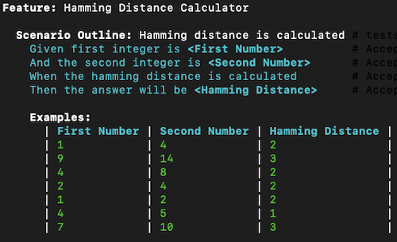
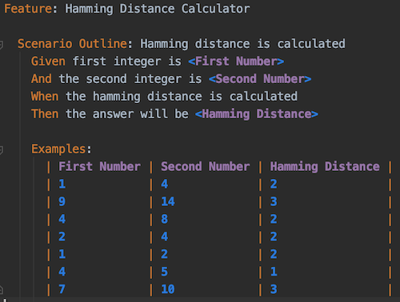

# Testing the Hamming Distance Calculator
* Execute this command in your command line terminal to run the acceptance tests specifically for the hamming distance 
calculator
    ```shell script
    docker-compose run --rm php bin/behat tests/acceptance/03-Hamming-Distance.feature
    ```
* The result should look like this.

    
    
* You can add more examples in the [/tests/acceptance/03-Hamming-Distance.feature](../tests/acceptance/03-Hamming-Distance.feature) 
acceptance test feature file to try different combinations and check if the result is correct.

    
    